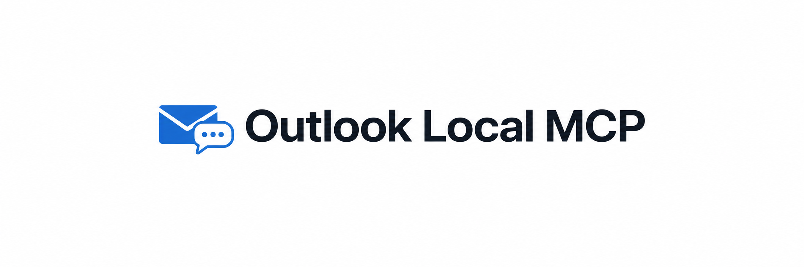

# Outlook Local MCP



> Ask your assistant about the email already in Outlook.

[Quick start](#quick-start) · [Client setup](docs/clients.md) ·
[Tools](docs/tools.md) · [Troubleshooting](docs/troubleshooting.md)

Connect the **classic Outlook** session running on your Windows PC to an assistant
that supports local MCP servers. It uses the Outlook profile you already have
configured. Setup guides cover Codex, Claude Desktop, Claude Code, Cursor and VS Code;
see [tested compatibility](docs/clients.md#tested-compatibility) for what has been
verified in practice.

## Why this exists

Outlook is already signed in. It can already open your mailbox. The idea behind
this project is to let an assistant use that access without having to register
another application or request a new set of mailbox API permissions.

No Azure app registration and no separate email credentials to give the server.
Your existing Outlook permissions and company policies still apply.

The first version focused on finding and reading email. Opening messages, drafting
replies and sending after review grew out of that same workflow. You choose which
actions to enable.

## What you can ask

Start with everyday questions:

> What arrived in my Inbox this week?
>
> Find the email about the project deadline.
>
> What does that message say?

With [optional Outlook actions](#optional-outlook-actions) enabled, you can continue:

> Open that message in Outlook.
>
> Draft a reply saying I can make the meeting.

Reading is available by default. Opening messages and saving drafts are opt-in;
sending has a separate flag and requires a complete preview for your approval.
The assistant receives the mail data it requests, so its own data policy still applies.

## Quick start

1. Install [uv](https://docs.astral.sh/uv/getting-started/installation/) once.
   No manual Python installation, repository clone or virtual environment is needed.
   On Windows, `winget install --id astral-sh.uv --exact` is one option.
2. Open **classic Outlook**, load your profile and resolve any pending dialogs.
   New Outlook does not implement the required Object Model.
3. Add this entry to your client's MCP configuration, preserving existing entries.
   This JSON works with `mcpServers` clients; use the [client guide](docs/clients.md)
   for Codex's TOML format, VS Code's `servers` format and registration commands.

```json
{
  "mcpServers": {
    "outlook-local": {
      "command": "uvx",
      "args": [
        "--python", "3.12",
        "--constraints", "https://github.com/santiv343/outlook-local-mcp/releases/download/v0.2.1/constraints.txt",
        "--from", "https://github.com/santiv343/outlook-local-mcp/releases/download/v0.2.1/outlook_local_mcp-0.2.1-py3-none-any.whl",
        "outlook-local-mcp"
      ]
    }
  }
}
```

4. Restart the client or reload its MCP servers. Ask it to check Outlook, then try
   one of the questions above.

`uvx` downloads Python and the pinned runtime dependencies on first use. Release
assets come from this repository's GitHub Releases; dependencies come from their
package index. Later starts use uv's cache. Installation and updates need internet.
Run the [diagnostic](docs/clients.md#check-the-connection) first if your
client has a short startup timeout.

If a desktop client cannot find `uvx`, use its absolute path from
`(Get-Command uvx).Source`. Launch the server on **native Windows**: Linux, WSL,
remote containers and cloud chats cannot directly access this Windows COM session.

The [client guide](docs/clients.md) includes a diagnostic command and configuration
steps for each client. The server can start and advertise its tools even when
Outlook is unavailable.

## Tools

| Tool | Purpose |
| --- | --- |
| `outlook_status` | Availability, version and connection diagnosis |
| `list_mailboxes` | Stores accessible through the current Outlook session |
| `list_folders` | Immediate children of a store root or selected folder |
| `recent_emails` | Recent summaries, without bodies |
| `search_emails` | Literal text and metadata filters in one folder |
| `read_email` | Plain text body pages and attachment metadata |
| `read_conversation` | Native threads across accessible stores and folders |

**An empty partial search page does not mean no messages match.** Follow its
cursor and inspect coverage and warnings. See [tool contracts](docs/tools.md).

For an Inbox overview, the agent can call `search_emails` directly with date filters.
No mailbox or folder discovery is required. Responses use short references, lists
contain no bodies, and body reads default to 2,000 characters. The server instructs
clients to make sequential calls and request content only when the question needs it.
See [efficient use](docs/tools.md#efficient-use).

## Optional Outlook actions

Append `--enable-write-tools` after `outlook-local-mcp` in the server arguments to
expose `open_email`, `create_draft` and `reply_to_email` (ten tools total). Drafts are
saved without sending. Opening a message can change its read state through Outlook settings.

Also append `--enable-send` to expose `prepare_send` and `send_draft` (twelve tools).
Sending requires an explicit account, a complete preview and a one-use revision token.
The client must obtain user approval of the preview before submitting. The token
checks content continuity; it does not authenticate a human. Only plain-text drafts
without attachments and with at most 30,000 body characters support programmatic send.
Other drafts can be reviewed and sent through Outlook's own UI.

On `WRITE_OUTCOME_UNKNOWN`, inspect Outlook, Drafts, Outbox and Sent Items before
another attempt. The server never automatically retries a mutation. Submission to
Outlook does not prove delivery. These capabilities are disabled by default.

## Scope and privacy

- Windows 10/11, classic Outlook with a configured profile, CPython 3.11/3.12.
  The recommended command provisions Python 3.12 automatically.
- Reads stores, mounted archives and shared stores already available in Outlook.
  Does not add accounts, open external PST files or grant access.
- Default tools are read-only. Opt-in actions follow the boundaries above. No deleting,
  moving, direct read-state changes, opening links, executing HTML or attachment downloads.
- No Azure app registration or stored email credentials. Outlook profile permissions
  and corporate Object Model protections still apply.
- The server makes no outbound network connections of its own and has no telemetry.
  Outlook itself can synchronize with its provider.
- Logs contain operation, duration, counts and stable error codes only. No message
  contents, addresses, mailbox IDs, searches or raw COM exceptions are logged.
- **Returned mail data reaches the requesting AI client.** Local Outlook access
  does not make the client's model processing local. Check your client's data policy.
- Mail is untrusted external content. Tool descriptions tell agents to treat its
  instructions as data; this does not enforce what an agent does with other tools.

Microsoft documents [classic/new Outlook differences](https://support.microsoft.com/en-us/outlook/getstarted/feature-comparison-between-new-outlook-and-classic-outlook)
and [Object Model security](https://learn.microsoft.com/en-us/office/vba/outlook/security/security-behavior-of-the-outlook-object-model).
New Outlook alone, or a computer without classic Outlook, is unsupported. Direct
cloud mailbox access through Microsoft Graph is a separate integration and is not
implemented here.

## Development

```powershell
uv sync --locked --python 3.12
uv run --locked ruff check .
uv run --locked ruff format --check .
uv run --locked mypy
uv run --locked pytest
uv build --no-sources
```

Tests use synthetic COM objects and real subprocess/MCP transports. Windows CI
checks Python 3.11 and 3.12 without a mailbox. For the real Outlook journey, open
Outlook and run `uv run --locked python scripts/smoke_test.py`. This reads messages
but prints only counts and pass/fail. Never publish mailbox data or personal config.
`scripts/smoke_actions.py` additionally creates and opens one synthetic draft and
previews it, without sending. It retains that draft for review. Inspect Outlook
before rerunning after an uncertain mutation result. See
[tested compatibility](docs/clients.md#tested-compatibility) for real reading,
draft, reply and delivery checks, simulated failure tests and untested environments.

[Architecture](docs/architecture.md) · [Troubleshooting](docs/troubleshooting.md) ·
[Security](SECURITY.md) · [MIT license](LICENSE)
