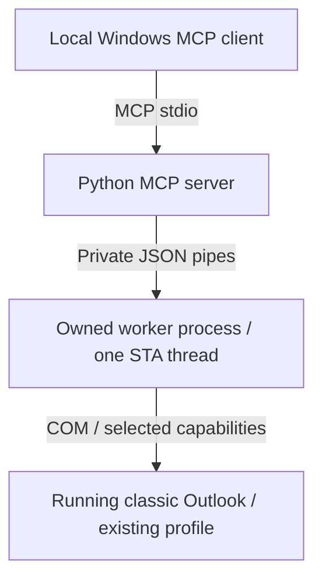

# Architecture

The official MCP Python SDK 2.x owns protocol handling. The server uses explicit
schemas and capability-specific annotations. Every client uses the same tools:
seven by default, ten with draft/UI actions, twelve with optional sending.

## Responsibilities

- `server.py`, `contracts.py`, `models.py`: validate inputs, publish schemas,
  sanitize errors and log content-free metrics. stdout is reserved for MCP.
- `supervisor.py`: one active operation and one queued operation. The 30-second
  deadline starts at admission, including queue time. A third request gets `SERVER_BUSY`.
- `worker.py`, `outlook.py`, `com_types.py`: COM objects live exclusively on the
  worker's main STA thread. Connection is lazy and attaches only to running Outlook.
- `mail.py`, `filters.py`, `pagination.py`: map properties and traverse bounded
  collections. Only serializable data crosses the private worker pipes.
- `client_config.py`: optional client setup, outside the MCP transport.
- `drafts.py`, `accounts.py`, `sending.py`: explicit account selection, native drafts,
  complete previews and one-use submission. No automatic mutation retries.
- `references.py`: bounded short IDs translated at the worker JSON boundary;
  Outlook and cursor logic retain native, store-bound identities internally.

## Process lifecycle

A task timeout cannot interrupt blocked COM. Active timeouts and cancellations
terminate and reap the owned worker. A subsequent call creates a new worker,
invalidating old cursors, short references and send previews. Queued timeouts never
kill the operation ahead of them. A dispatched mutation with a timeout, cancellation
or broken worker connection returns `WRITE_OUTCOME_UNKNOWN`, never a retryable result.
The server never starts Outlook, opens login dialogs or calls Outlook.Quit.

Client EOF cancels active work through the SDK connection lifecycle; final cleanup
closes the supervisor. Cleanup has a two-second deadline beyond the operation
deadline. An operating-system kill of the MCP parent is outside the graceful
connection-shutdown guarantee.

On Windows a CPython venv executable launches another process. The supervisor
invokes the base interpreter and sets `__PYVENV_LAUNCHER__` to preserve the current
environment. This CPython-specific boundary has real PID/exit tests. See
[CPython path initialization](https://github.com/python/cpython/blob/3.12/Modules/getpath.py).
No process-name searches or blanket process-tree termination are used.

## Search and consistency

Calls inspect up to 1,000 candidates or ten cooperative seconds, with an external
30-second deadline for blocking COM. Date filters generate a conservatively widened
UTC DASL window using Windows regional formatting. Python enforces exact boundaries
and literal text predicates. User text never enters DASL expressions.

One-use cursors bind the tool, location and filters; only page size can change.
Validate before consuming. Invalid arguments preserve the cursor, while a failure
after advancing discards that continuation. Cursor state contains no message bodies.

Cursors have an absolute ten-minute lifetime and twenty active sessions maximum.
Each session remembers up to 20,000 IDs or approximately 4 MiB of ID bookkeeping.
Duplicates are suppressed by EntryID; arrivals, moves and deletions can still change
results. There is no snapshot or exact total. Exhaustion means traversal ended;
`evaluation_complete` additionally requires no omitted candidates across the session.

Native conversation tables reuse the same cursor engine and include each row's
store ID. Their deduplication keys include both store and message identity. Short
references also bind item/folder IDs to a store. Successful use or re-emission refreshes
reference TTL; cursor/send-preview expiry is unchanged. Reference capacity failure
explicitly resets the backend, removing unpublished continuations and previews.

Send account references can disappear when Outlook releases/re-fetches a draft.
The preview therefore binds an explicit account for the approved MCP send. Validation
before assignment requires a saved draft and identical content/modification time;
after assignment it checks account and content without treating its own dirty flag
as a user edit. PUTREF, response construction and serialization are inside the
unknown-mutation boundary. COM references never leave the STA worker.

Represented From identity has a stricter absence rule than general item lookup.
Only exact numeric `MAPI_E_NOT_FOUND`, directly or in a valid `DISP_E_EXCEPTION`
wrapper without conflicting status, or a successful empty string allows the
fallback path. The broad `ITEM_NOT_FOUND` category, denied/inaccessible identity
and malformed or unexpected values never authorize fallback. A nonempty represented
SMTP identity must validate and match the selected account. A represented display
name is resolved rather than treated as proof of delegation or absence.

References: [STA requirement](https://learn.microsoft.com/en-us/office/client-developer/outlook/selecting-an-api-or-technology-for-developing-solutions-for-outlook),
[Items.Restrict](https://learn.microsoft.com/en-us/office/vba/api/outlook.items.restrict),
[date comparisons](https://learn.microsoft.com/en-us/office/vba/outlook/how-to/search-and-filter/filtering-items-using-a-date-time-comparison).

## Distribution

`uv.lock` records resolved dependencies. Releases include a wheel and runtime
constraints exported from that lock. The uvx command passes both: a wheel alone
would not enforce the source lock. Versioned URLs make updates deliberate. A release
is installation-verified only after fetching its public assets outside the checkout.
